[](https://github.com/michalowskil/flex-cells-card/discussions)
 [](https://github.com/michalowskil/flex-cells-card/releases) [](https://github.com/michalowskil/flex-cells-card/releases/latest) [](https://community.home-assistant.io/t/new-lovelace-card-flex-cells-card/919780)

# Flex Cells Card

A Lovelace card for Home Assistant that lets you add **icons**, **text**,  **entities**, **attributes**, or **input controls** in flexible cell layouts — fully configurable from a **visual editor**, so **no documentation is required** to get started.

If you like this card, please consider giving it a ⭐ on GitHub: [](https://github.com/michalowskil/flex-cells-card/stargazers)

## Features
- Mix cells with **Icon / Text / Entity / Metadata / Input Control**
- **Dynamic Rules**: Color & Content Overrides
- **Sorting** by one or more columns in one or more **groups**
- Using **icons and colors assigned to entities by the system**
- **Per-cell actions:** tap, hold, double-tap (mobile-friendly)
- Per-cell **alignment**, **text transform**, **color**, **size**, **letter spacing**
- Entities with unit handling and optional precision
- Visual editor, drag-and-drop rows/columns, zebra rows, responsive columns

## Installation

### HACS – Custom repository

1. HACS → ⋮ → **Custom repositories** → add:
   `https://github.com/michalowskil/flex-cells-card` (Type: **Dashboard**) or just click the button below to do the same:  
   [](https://my.home-assistant.io/redirect/hacs_repository/?owner=michalowskil&repository=flex-cells-card&category=plugin)
2. Install **Flex Cells Card**.
3. Resource is added automatically as `/hacsfiles/flex-cells-card/flex-cells-card.js`.
4. Reload browser cache or refresh resources in HA if needed.

### Manual

1. Download `flex-cells-card.js` from the latest release and place it under  
   `config/www/flex-cells-card/flex-cells-card.js`.
2. Add a resource in **Edit Dashboard → ⋮ → Manage resources**:  
   `/local/flex-cells-card/flex-cells-card.js` (type: **JavaScript module**).
3. Hard refresh the browser.

## Usage
Add the card in the UI and configure everything from the visual editor.

## Video

Olli from the YouTube channel [@smarterkram](https://www.youtube.com/@smarterkram) recorded a video explaining this card. If you know German, I encourage you to watch it https://www.youtube.com/watch?v=oh36grjbPDQ

## Tips & Tricks

<details markdown="1"><summary>How sorting works</summary>

- Sorting works "after applying" dynamic rules, meaning what's visible is sorted.
- Sorting works even if the column being sorted is hidden (breakpoint).
</details>

<details markdown="1"><summary>Dynamic rules</summary>

- For example, if you want to change what an entity displays to a defined text, while keeping "more-info" on click, you can add a rule without an entity, with the operator set to "not equal" and an empty "value". This condition will always be met.
- If you see the value "null" for an attribute in developer tools and want to use it in dynamic rules, don't enter "null" but leave value input empty. Empty means "null".
</details>

<details markdown="1"><summary>Available colors</summary>

- You can specify colors in various formats, one of which is variables, for example "var(--state-active-color)". You can find a list of variables at this link https://github.com/home-assistant/frontend/blob/dev/src/resources/theme/color/color.globals.ts
</details>

<details markdown="1"><summary>Copy & Paste / Search & Replace</summary>

- You don't have to perform repetitive actions in the visual editor. For example, if you want to create many similar rows, create one in the visual editor, then go to the code editor and "copy & paste" it as many times as you want, along with all its configuration. You can then return to the visual editor and change the details.
- If you want to perform the same action on multiple rows/cells, use the code editor and the "search & replace" function. For example, if you want to remove all underlines, search for "underline: true" and replace it with "underline: false".
</details>

## Changelog
- v0.13.0-beta (Pre-release) —
  - Added **separators** and **sorting by groups**.
  - Added **dynamic rules for the entire row**.
- v0.12.0 —
  - Added **metadata** (instead of attributes), now we have access to all data.
  - Improved "_Text size (default)_" in the main settings, it no longer affects icon size.
  - Added icon size settings (entity-derived icon).
  - Changed "_Date/Time format_" to "_Date/Time format & Text override_". Now we can override the entity value even if it doesn't contain a date/time.
  - Minor visual improvements.
- v0.11.0 —
  - Added use of **system-assigned icons and colors** for entities.
  - Changed the decimal separator to use the system settings.
  - Disabled the default underline for entities.
- v0.10.0 —
  - Added **dynamic sorting by single or multiple columns**.
  - Added a "tips & tricks" section to the readme.md.
  - Fixed the dropdown list display in dynamic rules.
- v0.9.0 —
  - Added **German translation**, thanks to [Olli](https://community.home-assistant.io/u/olli.dev/summary) and [Thomas](https://github.com/tmycgn).
  - Added **displaying an icon on the input_button** if configured.
  - Added ability to **select a background color** without the need for dynamic rules.
- v0.8.0 —
  - Added **formatting for input_datetime**.
- v0.7.0 —
  - Added **controls for input types**: boolean, number, select, button, datetime, text.
  - Added **"Appearance & Style" section** in the card editor for easier navigation.
- v0.6.0 —
  - Added **dynamic icons**.
- v0.5.0 —
  - Added **dynamic coloring/hiding/masking**.
  - Minor visual improvements.
- v0.4.0 —
  - Added **entity attributes** with per-attribute **rescaling** (Input/Output min/max).
  - Fixed **tap & hold** so secondary actions (e.g., setting brightness) work alongside the primary action.
  - Fixed **header/last row background** overflow when card padding is set to `0`.
- v0.3.0 — 
  - Added **inline color picker** with live preview.
- v0.2.0 —
  - Added per-cell actions: **tap / hold / double-tap**.
- v0.1.x —
  - First basic release of the card.

## Screenshots

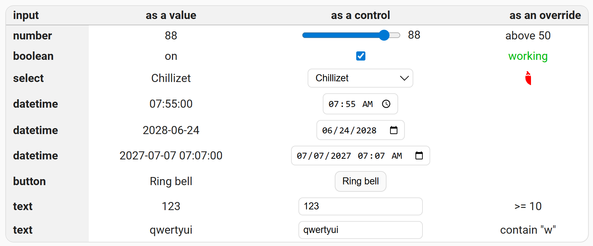
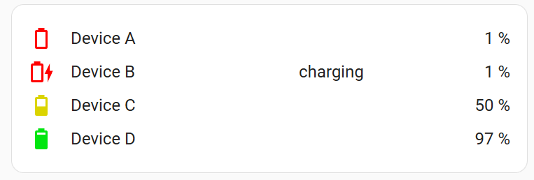
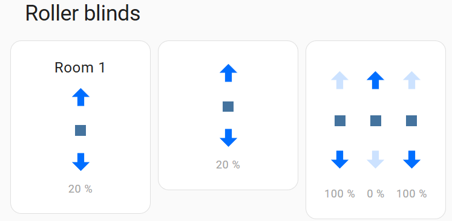
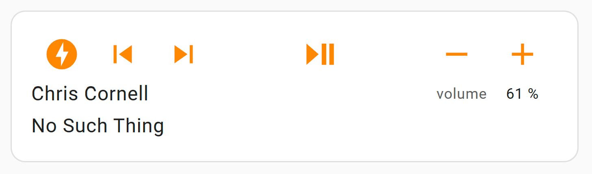
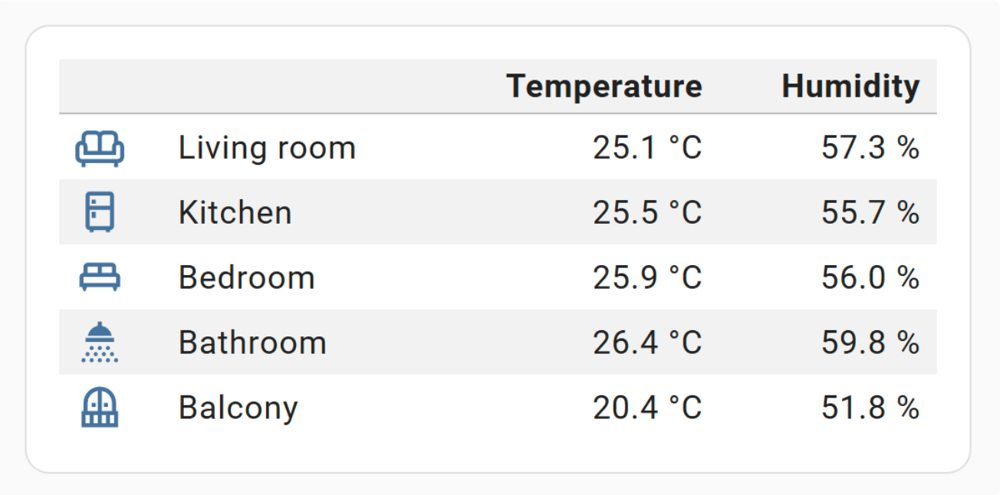
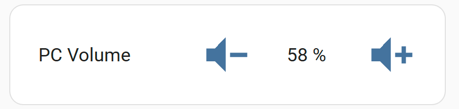
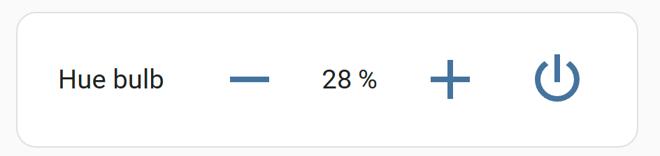
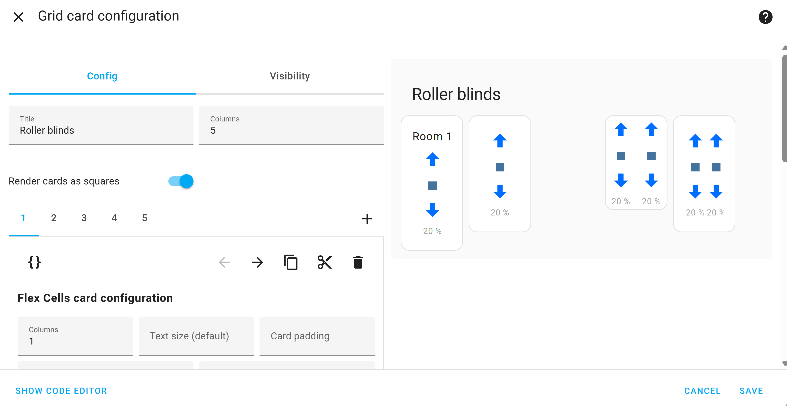

**Main configuration view**

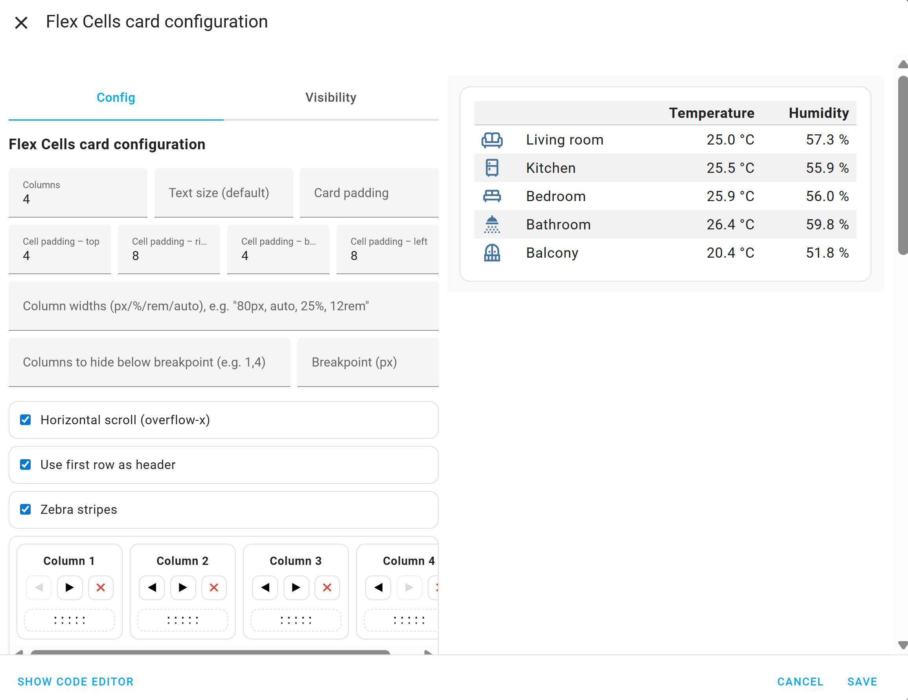

**Row and cell configuration**

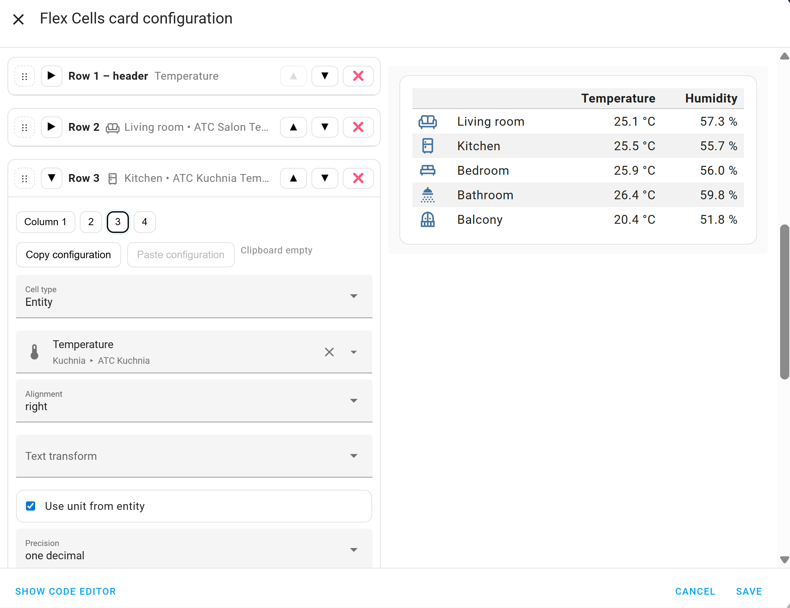

**Tap & Hold Actions**

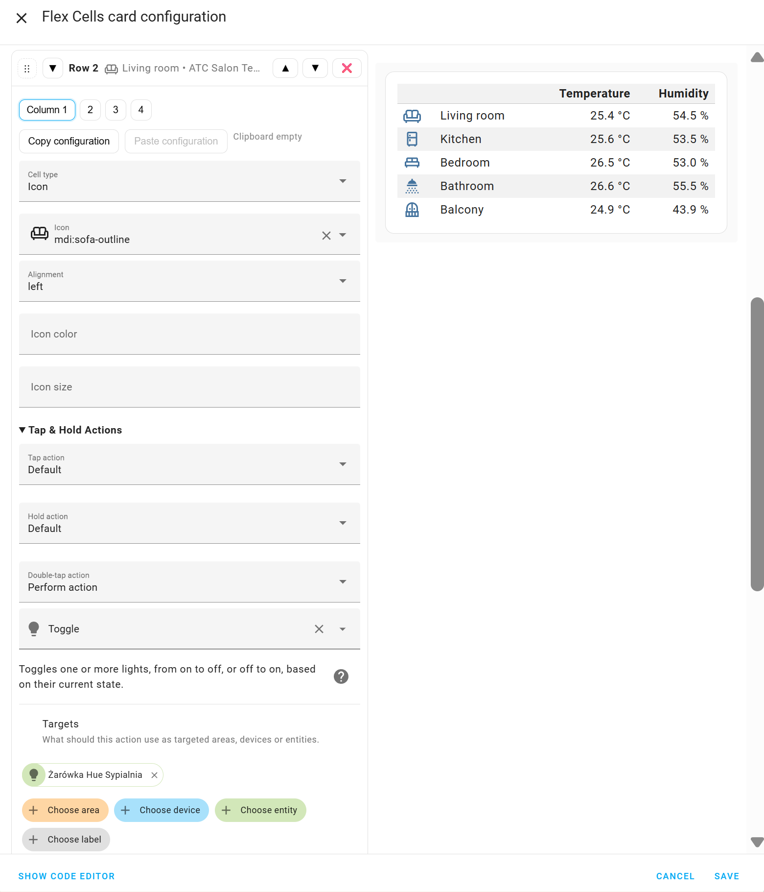

## Example YAML
```yaml
type: 'custom:flex-cells-card'
```