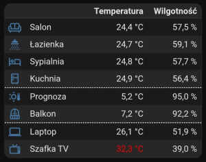
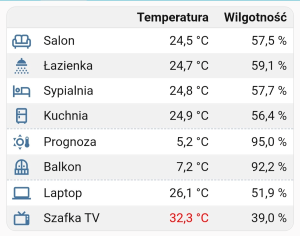
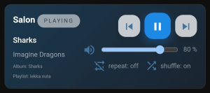
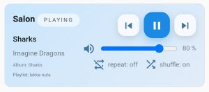

[](https://github.com/michalowskil/flex-cells-card/discussions)
 [](https://github.com/michalowskil/flex-cells-card/releases) [](https://github.com/michalowskil/flex-cells-card/releases/latest) [](https://community.home-assistant.io/t/new-lovelace-card-flex-cells-card/919780)

# Flex Cells Card

A Lovelace card for Home Assistant that lets you add **icons**, **text**,  **entities**, **attributes**, or **input controls** in flexible cell layouts — fully configurable from a **visual editor**, so **no documentation is required** to get started.

If you like this card, please consider giving it a ⭐ on GitHub: [](https://github.com/michalowskil/flex-cells-card/stargazers)

## Features
- Mix cells with **Icon / Text / Entity / Metadata / Input Control**
- **Dynamic Rules**: Color & Content Overrides
- **Sorting** by one or more columns in one or more **groups**
- Using **icons and colors assigned to entities by the system**
- **Per-cell actions:** tap, hold, double-tap (mobile-friendly)
- Per-cell **alignment**, **text transform**, **color**, **size**, **letter spacing**
- Entities with unit handling and optional precision
- Visual editor, drag-and-drop rows/columns, zebra rows, responsive columns
- **HTML templates** thanks to which the card can look exactly as you want (HTML and CSS knowledge required)
- Each cell and row allows you to configure **custom CSS**, you don't need to use "card_mod" for this

## Installation

### HACS – Custom repository

1. HACS → ⋮ → **Custom repositories** → add:
   `https://github.com/michalowskil/flex-cells-card` (Type: **Dashboard**) or just click the button below to do the same:  
   [](https://my.home-assistant.io/redirect/hacs_repository/?owner=michalowskil&repository=flex-cells-card&category=plugin)
2. Install **Flex Cells Card**.
3. Resource is added automatically as `/hacsfiles/flex-cells-card/flex-cells-card.js`.
4. Reload browser cache or refresh resources in HA if needed.

### Manual

1. Download `flex-cells-card.js` from the latest release and place it under  
   `config/www/flex-cells-card/flex-cells-card.js`.
2. Add a resource in **Edit Dashboard → ⋮ → Manage resources**:  
   `/local/flex-cells-card/flex-cells-card.js` (type: **JavaScript module**).
3. Hard refresh the browser.

## Usage
Add the card in the UI and configure everything from the visual editor.

## Video

Olli from the YouTube channel [@smarterkram](https://www.youtube.com/@smarterkram) recorded a video explaining this card. If you know German, I encourage you to watch it https://www.youtube.com/watch?v=oh36grjbPDQ

## Tips & Tricks

- How sorting works
  - Sorting works "after applying" dynamic rules, meaning what's visible is sorted.
  - Sorting works even if the column being sorted is hidden (breakpoint).

- Dynamic rules
  - For example, if you want to change what an entity displays to a defined text, while keeping "more-info" on click, you can add a rule without an entity, with the operator set to "not equal" and an empty "value". This condition will always be met.
  - If you see the value "null" for an attribute in developer tools and want to use it in dynamic rules, don't enter "null" but leave value input empty. Empty means "null".

- Available colors
  - You can specify colors in various formats, one of which is variables, for example "var(--state-active-color)". You can find a list of variables at this link https://github.com/home-assistant/frontend/blob/dev/src/resources/theme/color/color.globals.ts

- Copy & Paste / Search & Replace
  - You don't have to perform repetitive actions in the visual editor. For example, if you want to create many similar rows, create one in the visual editor, then go to the code editor and "copy & paste" it as many times as you want, along with all its configuration. You can then return to the visual editor and change the details.
  - If you want to perform the same action on multiple rows/cells, use the code editor and the "search & replace" function - to see additional options press Ctrl + F in code editor. For example, if you want to remove all underlines, search for "underline: true" and replace it with "underline: false".

## Templates
  - Templates, in addition to standard HTML tags, support their own tag:  
    `<fcc row="3" col="5" />` - inserts the selected cell  
    `<fcc row="3" />` - inserts the selected row  
    `<fcc />` - inserts the entire table, which looks the same as without templates. This allows you to write custom CSS for the entire table:
    
    ```html
    <style>
      ...
    </style>
    <fcc />
    ```
  - If you want a non-fcc-table element to be dynamic (for example, `<div>`), you can use the `mode="text"` attribute (alias `as="text"`) for a text-type cell. For example, you can set a dynamic rule like this:

    ```yaml
    - cells:
        - type: string
          value: "display: none;"
          align: left
          style:
            text_transform: ""
          dyn_color:
            - entity: light.hue_bulb
              attr: ""
              op: "="
              val: "on"
              bg: ""
              fg: ""
              overwrite: text
              overwrite_entity: ""
              overwrite_attr: ""
              text: "display: flex;"
    ```
    to use this cell like this:

    ```html
    <div style="<fcc mode="text" row="22" col="1" />">
        test
    <div>
    ```
  - The appearance and rules assigned to cells/rows should work in templates.

## Examples
  - [Temperature/Humidity](https://github.com/michalowskil/flex-cells-card/blob/main/examples/temperature-humidity-table/temperature-humidity.md) - a simple table divided into three groups, with sorting by the temperature column performed independently in each group. Here you'll find the simplest example of a dynamic rule that changes color to red when the temperature exceeds a specified value.  
  
    [](https://github.com/michalowskil/flex-cells-card/blob/main/examples/temperature-humidity-table/temperature-humidity.md)
    [](https://github.com/michalowskil/flex-cells-card/blob/main/examples/temperature-humidity-table/temperature-humidity.md)
  - [Media Player (template)](https://github.com/michalowskil/flex-cells-card/blob/main/examples/media-player-template/media-player.md) - FCC template example (HTML, CSS).  

    [](https://github.com/michalowskil/flex-cells-card/blob/main/examples/media-player-template/media-player.md)
    [](https://github.com/michalowskil/flex-cells-card/blob/main/examples/media-player-template/media-player.md)
  - More examples coming soon.

## Changelog
- v0.16.0 —
  - Added **advanced copy and paste** of table configuration.
- v0.15.0 —
  - Added **custom HTML templates**.
  - Added **custom CSS** for cells and rows (also works in templates), "card_mod" is no longer needed!
  - Added **new domains**. The existing list of domains (input_boolean, input_number, input_select, input_button, input_datetime, input_text) that the editor considers as "input controls" has been expanded with new ones: **switch, number, select, button, datetime, date, time, text**.
  - Added **REL and REL_SHORT tokens** in the "Date/Time format & Text override" field, they return a localized description of the time elapsed (full and short).
  - Added support for "mode" variable for input_number. Now you can render a box in addition to the slider.
  - Added ability to hide values next to the slider (input_number).
  - Improved "Nothing" behavior in "Tap & Hold Actions".
  - Fixed separator width when breakpoint hides column.
  - Improved clickable area on "Show control" and "Use unit from entity" labels.
- v0.14.0 —
  - Added **column merging**.
  - Added entity/metadata overrides.
- v0.13.0 —
  - Added **separators** and **sorting by groups**.
  - Added **dynamic rules for the entire row**.
- v0.12.0 —
  - Added **metadata** (instead of attributes), now we have access to all data.
  - Improved "_Text size (default)_" in the main settings, it no longer affects icon size.
  - Added icon size settings (entity-derived icon).
  - Changed "_Date/Time format_" to "_Date/Time format & Text override_". Now we can override the entity value even if it doesn't contain a date/time.
  - Minor visual improvements.
- v0.11.0 —
  - Added use of **system-assigned icons and colors** for entities.
  - Changed the decimal separator to use the system settings.
  - Disabled the default underline for entities.
- v0.10.0 —
  - Added **dynamic sorting by single or multiple columns**.
  - Added a "tips & tricks" section to the readme.md.
  - Fixed the dropdown list display in dynamic rules.
- v0.9.0 —
  - Added **German translation**, thanks to [Olli](https://community.home-assistant.io/u/olli.dev/summary) and [Thomas](https://github.com/tmycgn).
  - Added displaying an icon on the input_button if configured.
  - Added ability to select a background color without the need for dynamic rules.
- v0.8.0 —
  - Added **formatting for input_datetime**.
- v0.7.0 —
  - Added **controls for input types**: boolean, number, select, button, datetime, text.
  - Added "Appearance & Style" section in the card editor for easier navigation.
- v0.6.0 —
  - Added **dynamic icons**.
- v0.5.0 —
  - Added **dynamic coloring/hiding/masking**.
  - Minor visual improvements.
- v0.4.0 —
  - Added **entity attributes** with per-attribute **rescaling** (Input/Output min/max).
  - Fixed tap & hold so secondary actions (e.g., setting brightness) work alongside the primary action.
  - Fixed header/last row background overflow when card padding is set to `0`.
- v0.3.0 — 
  - Added **inline color picker** with live preview.
- v0.2.0 —
  - Added per-cell actions: **tap / hold / double-tap**.
- v0.1.x —
  - First basic release of the card.

## Screenshots


**Main configuration view**


**Row and cell configuration**


**Tap & Hold Actions**


## Example YAML
```yaml
type: 'custom:flex-cells-card'
```