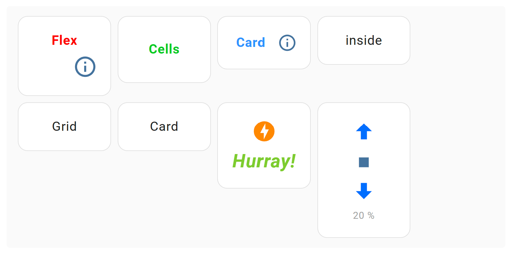

# Flex Cells Card

A Lovelace card for Home Assistant that lets you add **icons**, **text**,  **entities**, or **attributes** in flexible cell layouts — fully configurable from a **visual editor**, so **no documentation is required** to get started.

If you like this card, please consider giving it a ⭐ on GitHub:  
[](https://github.com/michalowskil/flex-cells-card/stargazers)

## Features
- Mix cells with **Icon / Text / Entity**
- Per-cell **alignment**, **text transform**, **color**, **size**, **letter spacing**
- Entities with unit handling and optional precision
- **Per-cell actions:** tap, hold, double-tap (mobile-friendly)
- Visual editor, drag-and-drop rows/columns, zebra rows, responsive columns

## Installation

### HACS – Custom repository

1. HACS → ⋮ → **Custom repositories** → add:
   `https://github.com/michalowskil/flex-cells-card` (Type: **Dashboard**) or just click the button below to do the same:  
   [](https://my.home-assistant.io/redirect/hacs_repository/?owner=michalowskil&repository=flex-cells-card&category=plugin)
2. Install **Flex Cells Card**.
3. Resource is added automatically as `/hacsfiles/flex-cells-card/flex-cells-card.js`.
4. Reload browser cache or refresh resources in HA if needed.

### Manual

1. Download `flex-cells-card.js` from the latest release and place it under  
   `config/www/flex-cells-card/flex-cells-card.js`.
2. Add a resource in **Edit Dashboard → ⋮ → Manage resources**:  
   `/local/flex-cells-card/flex-cells-card.js` (type: **JavaScript module**).
3. Hard refresh the browser.

## Usage
Add the card in the UI and configure everything from the visual editor.

## Changelog
- v0.4.x —
  - Added **entity attributes** with per-attribute **rescaling** (Input/Output min/max).
  - Fixed **tap & hold** so secondary actions (e.g., setting brightness) work alongside the primary action.
  - Fixed **header/last row background** overflow when card padding is set to `0`.
- v0.3.x — Added **inline color picker** with live preview.
- v0.2.x — Added per-cell actions: **tap / hold / double-tap**.
- v0.1.x — First basic release of the card.  
&nbsp;  
   [](https://github.com/michalowskil/flex-cells-card/releases) [](https://github.com/michalowskil/flex-cells-card/releases/latest)

### Screenshots

<table>
  <tr>
    <td></td>
    <td></td>
  </tr>
  <tr>
    <td colspan="2"></td>
  </tr>
</table>

**Main configuration view**
|  |
|---|

**Row and cell configuration**
|  |
|---|

**Tap & Hold Actions**
|  |
|---|

Example YAML:
```yaml
type: 'custom:flex-cells-card'
```