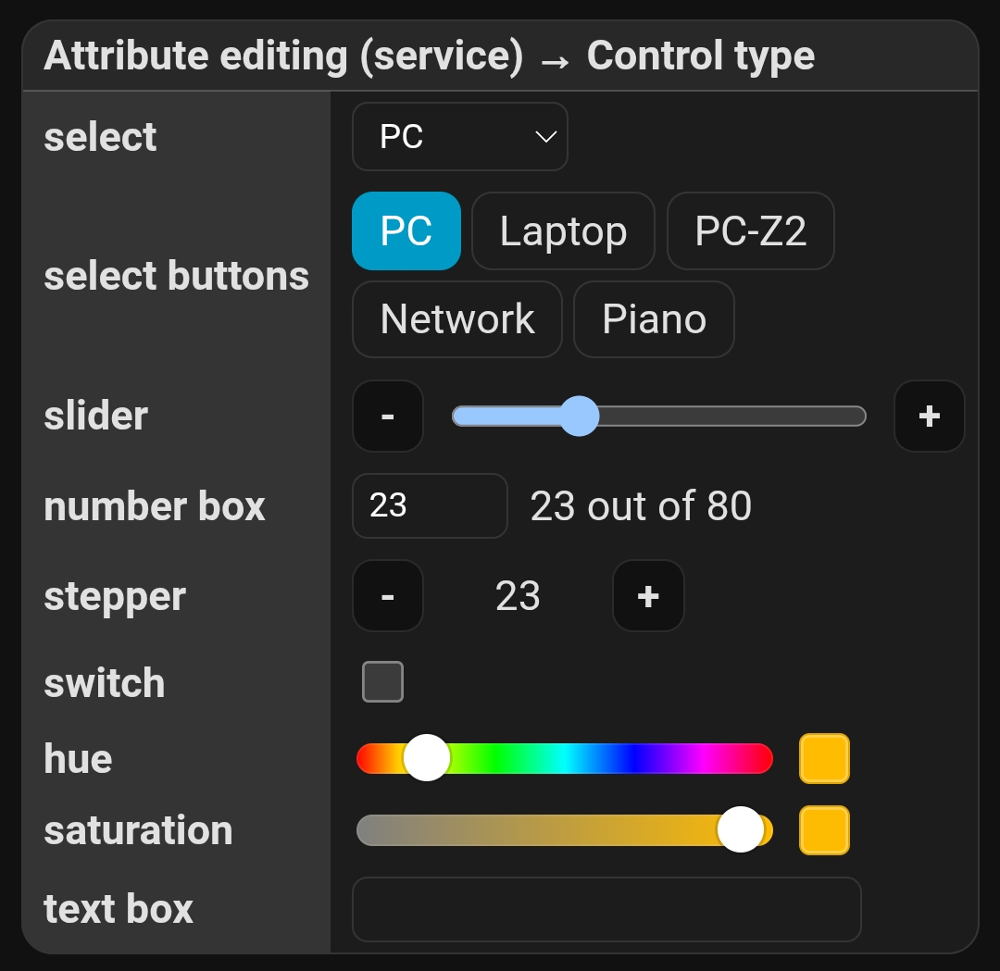
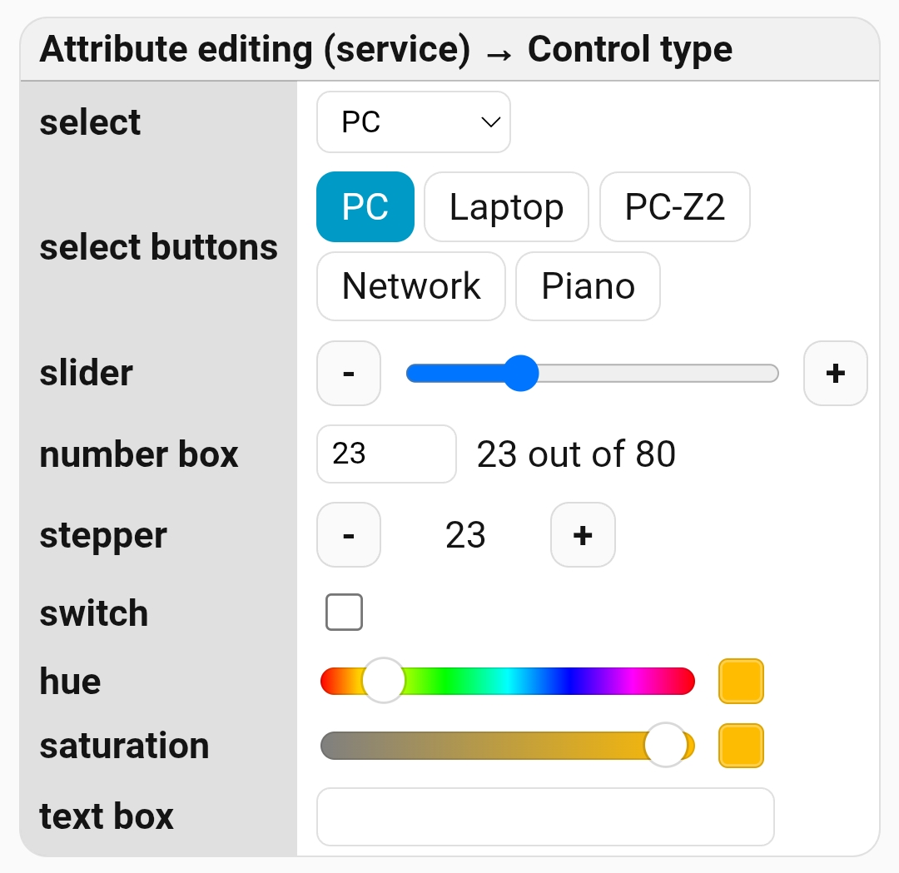

# Attribute editing controls

This example shows the controls available in **Attribute editing (service)**.

These controls read an entity attribute and call the configured Home Assistant service with `{ entity_id, [field]: value }`.

Add a new card to the dashboard and overwrite its entire configuration with the [attribute-controls.yaml](attribute-controls.yaml) file (remember to replace the entities with your own).

