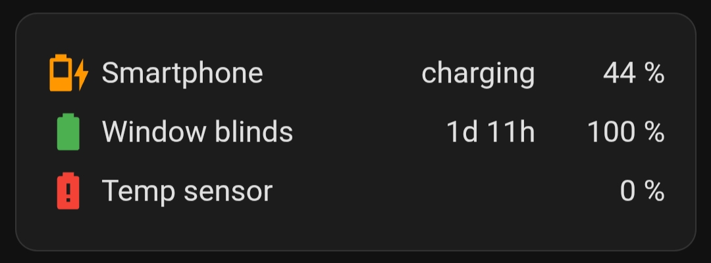
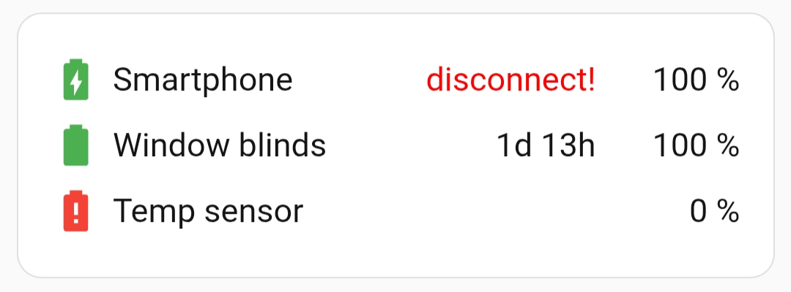

# Batteries table

This example displays battery information for three devices. Let's discuss this column by column.
- **Column 1** - entity icon:
  - smartphone: provides the correct icon and color, so nothing needs to be done here, just display it.
  - window blind: provides the icon and color, but they are only valid when the device is not charging, so 10 rules are used to override the icon while the device is charging (one rule every 10%).
  - temp sensor: provides the correct icon and color, nothing needs to be done here, just display it.
- **Column 2** - device name, these are static strings.
- **Column 3** - additional information:
  - smartphone: there are two dynamic rules, the first displays the time elapsed since the charger was disconnected (last_changed), the second overwrites the "full" string with the "disconnect!" string in red (when the charge level is 100% and the charger is still connected).
  - window blind: there are three dynamic rules here. The first displays the time elapsed since the charger was disconnected (last_changed). The second rule overwrites the "on" string with the "charging" string. The third displays the "disconnect!" string in red (when the charge level is 100% and the charger is still connected).
  - Temp sensor: This is a battery-powered device without charging capabilities, so we don't display anything here.
- **Column 4** - displays the battery charge level.

Note that different devices can have different states. For example, a smartphone can have "uncharging/charging/full" and a window blind can have "on/off."

Add a new card to the dashboard and overwrite its entire configuration with the [batteries.yaml](batteries.yaml) file (remember to replace the entities with your own).

