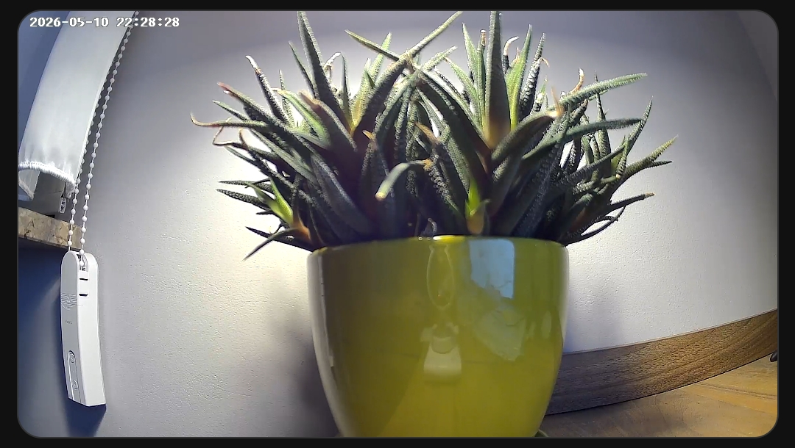
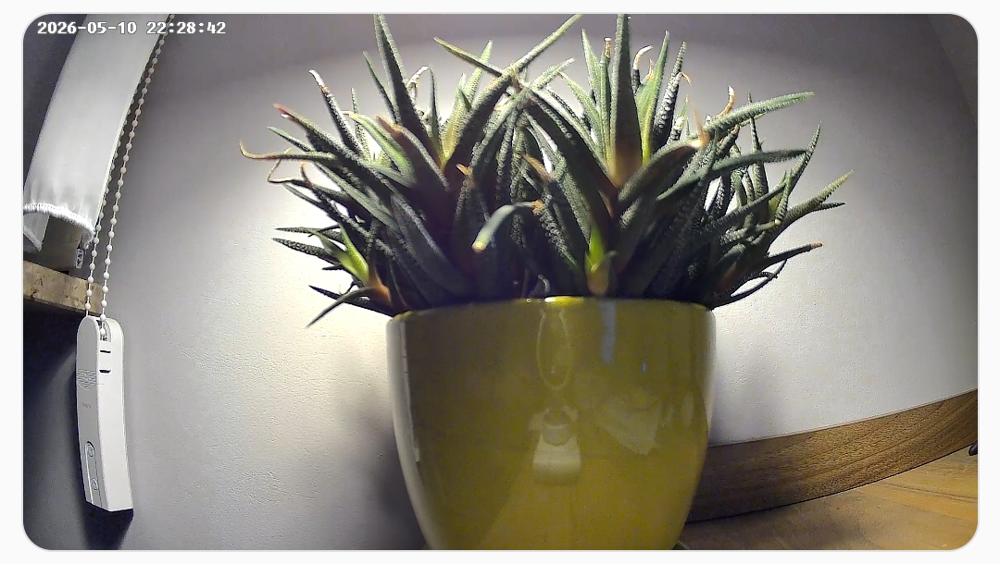
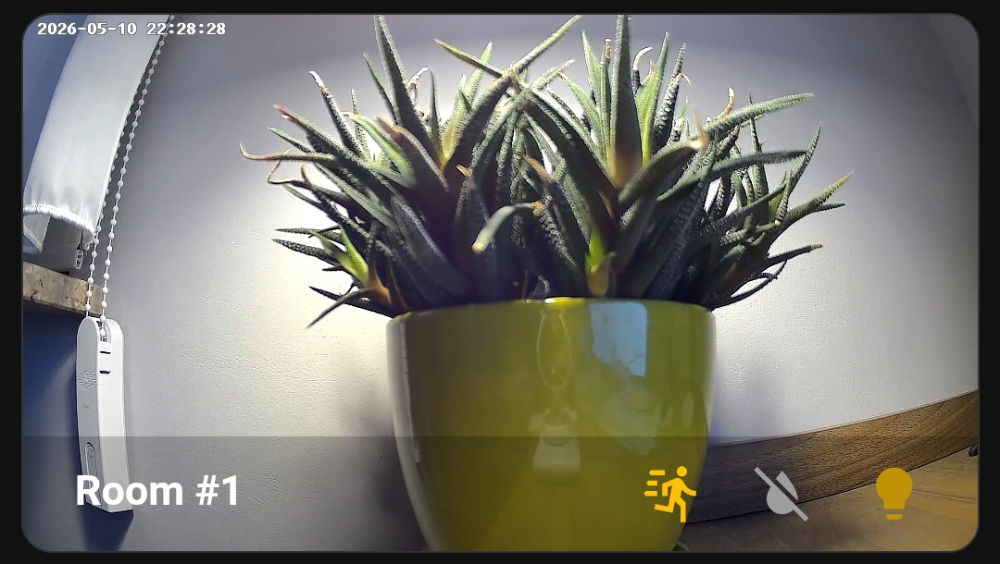
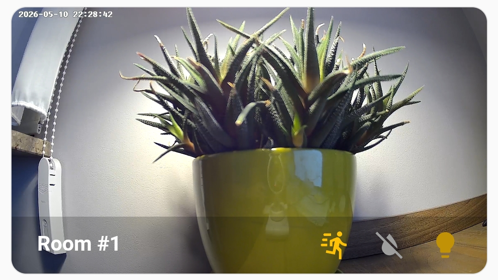
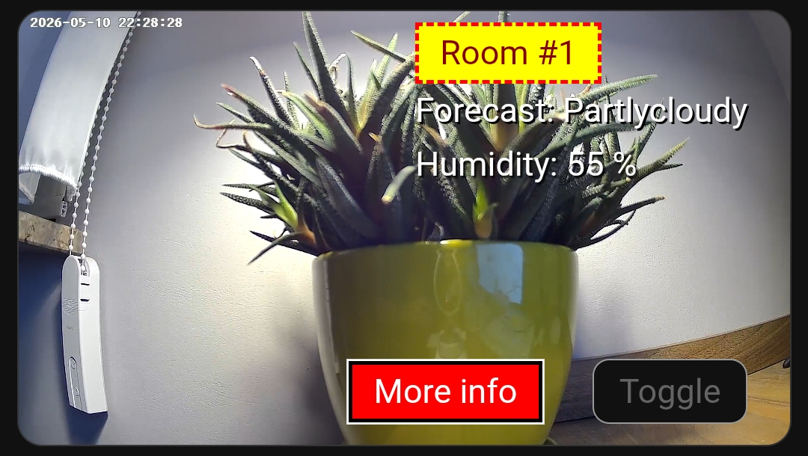
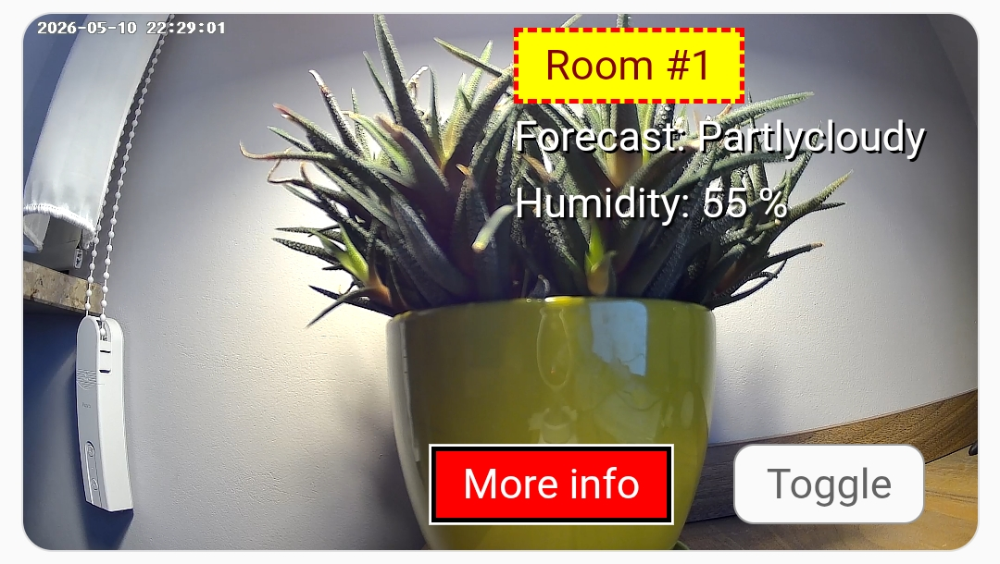

# Camera

The [first example](camera1.yaml) displays the camera image across the entire card surface by setting padding to zero.

The [second](camera2.yaml) and [third](camera3.yaml) examples feature additional buttons/information overlaid on the image using a simple HTML and CSS template.

Add a new card to the dashboard and overwrite its entire configuration with selected yaml file (remember to replace the entities with your own).

