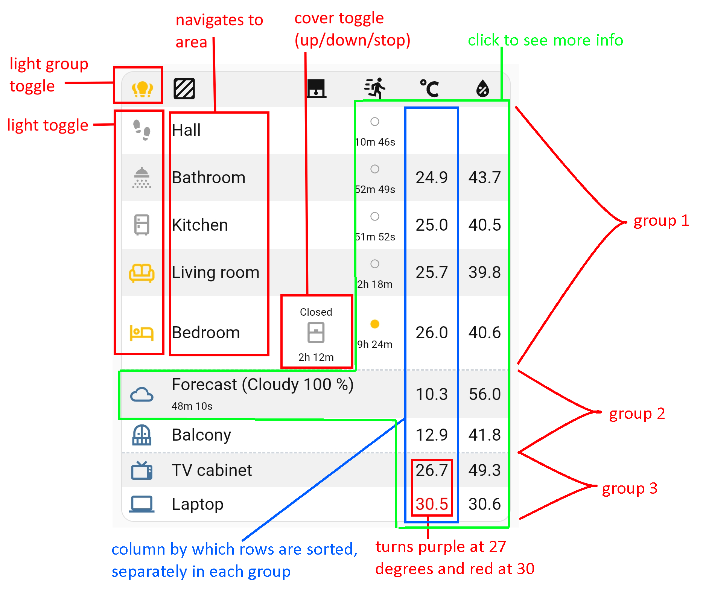
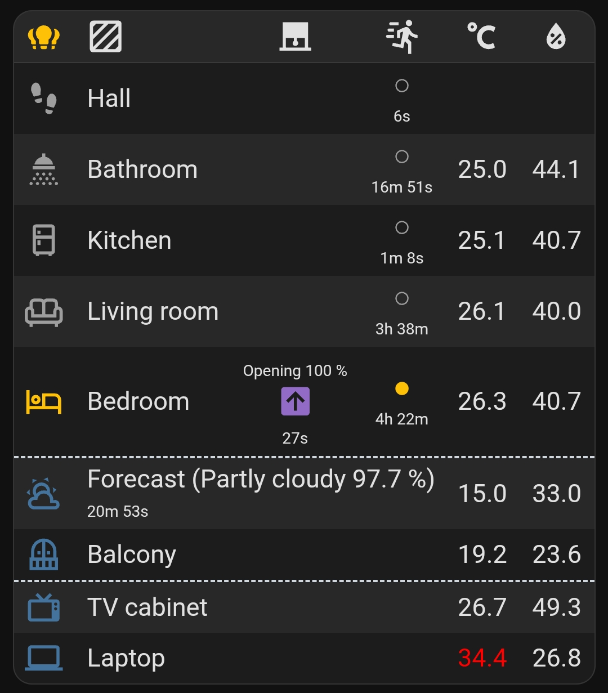
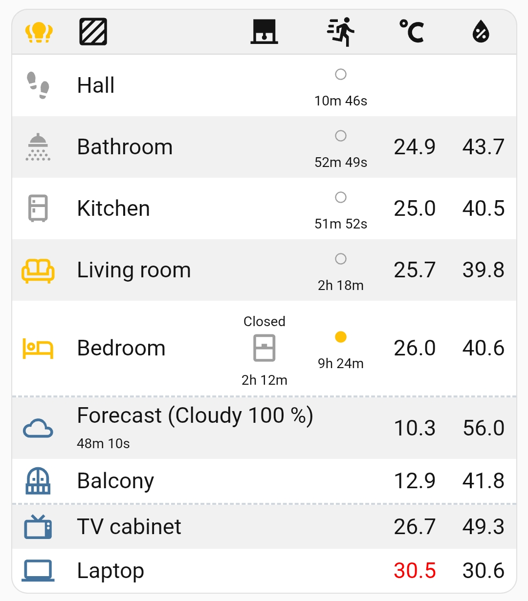

# Multifunction card (cell templates)

Cell templates allow you to place more than one element in a given cell. For example, you can hide the contents of a cell (or hide an entire row) and display it in another cell. For a brief introduction to cell templates, see [this link](https://github.com/michalowskil/flex-cells-card#per-cell-templates). If you have a basic understanding of HTML and CSS, using templates will come naturally. The functionality is described in the first image below.

Add a new card to the dashboard and overwrite its entire configuration with the [cell-templates.yaml](cell-templates.yaml) file (remember to replace the entities with your own).

