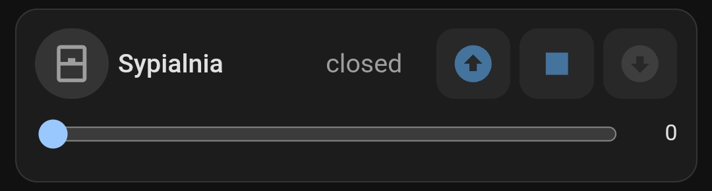
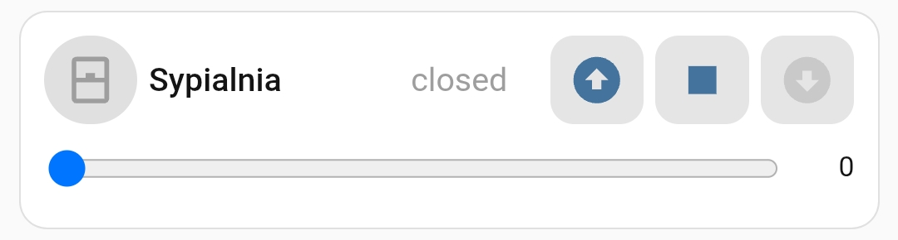
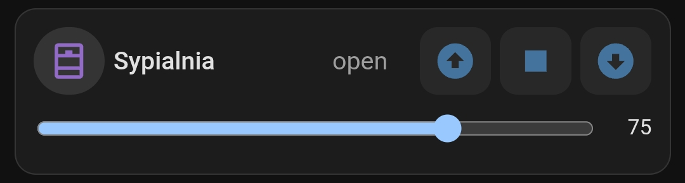
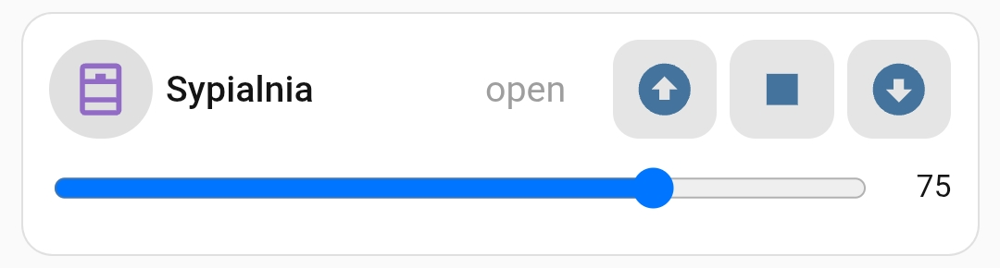
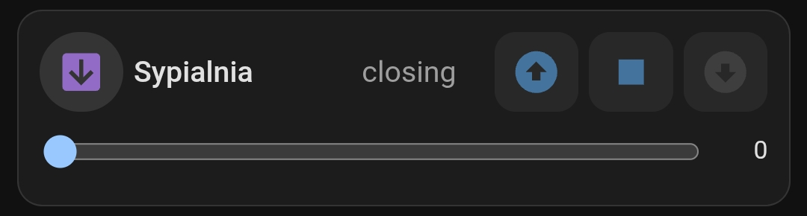
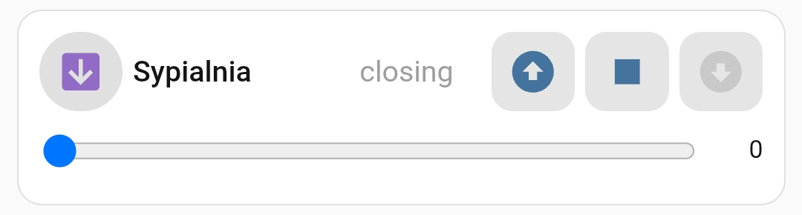

# Cover

This is an example similar to [Slider Lights](../slider-lights/slider-lights.md). The buttons for controlling the window blinds were created using custom CSS and icons.

Add a new card to the dashboard and overwrite its entire configuration with the [slider-lights.yaml](slider-lights.yaml) file (remember to replace the entities with your own).

