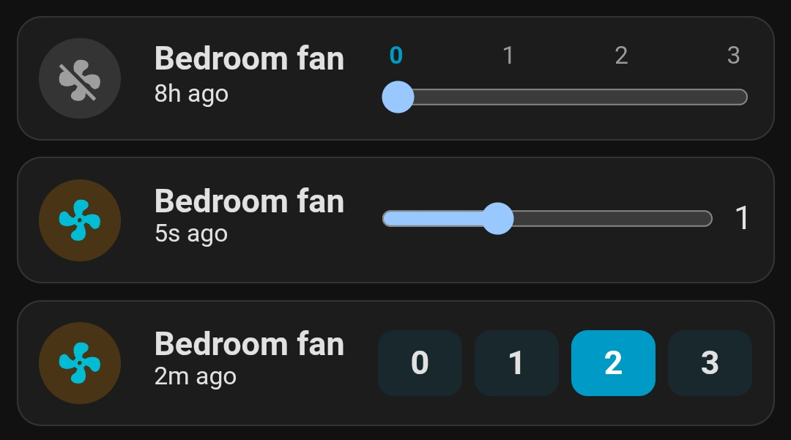
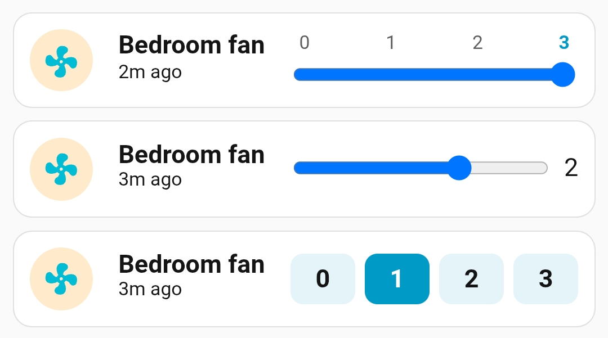

# Fan

Three fan control examples using `fan.set_percentage`, dynamic rules, custom CSS, and cell templates.

- [fan1.yaml](fan1.yaml) uses a global template to combine icon, name, last-changed time, speed labels, and an attribute-editing slider into one compact row.
- [fan2.yaml](fan2.yaml) is a simpler compact slider layout without a global template.
- [fan3.yaml](fan3.yaml) uses custom CSS and speed buttons instead of a slider.

Add a new card to the dashboard and overwrite its entire configuration with one of the YAML files above (remember to replace the entities with your own).

