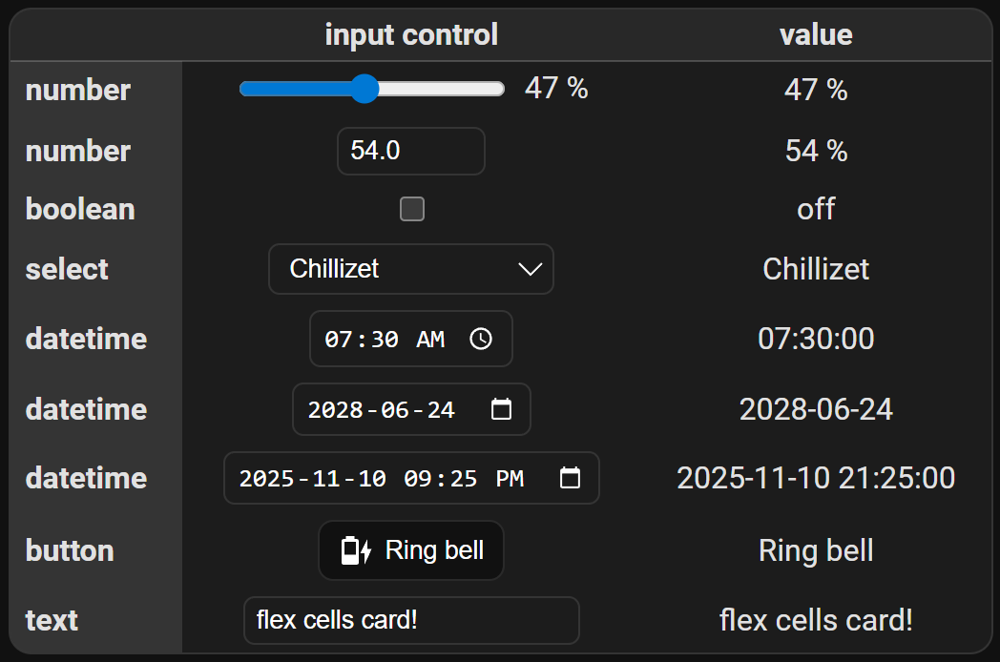
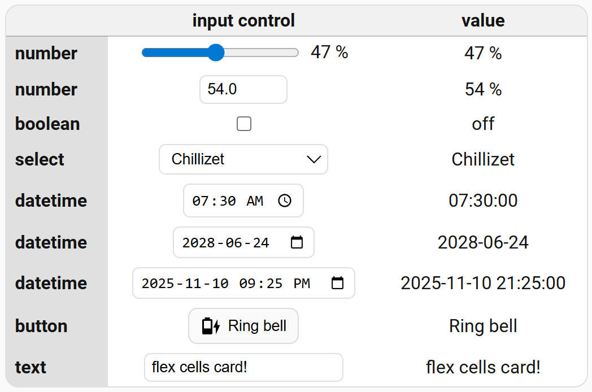

# Input controls

This is only a presentation of the appearance of the FCC controls.

Remember that in addition to the input controls configured in Home Assistant, you can also use the slider and switch (checkbox) on the fly without having to configure them in Home Assistant - ```Attribute editing (service)```.

Add a new card to the dashboard and overwrite its entire configuration with the [input-controls.yaml](input-controls.yaml) file (remember to replace the entities with your own).


