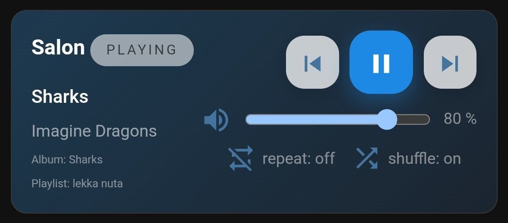
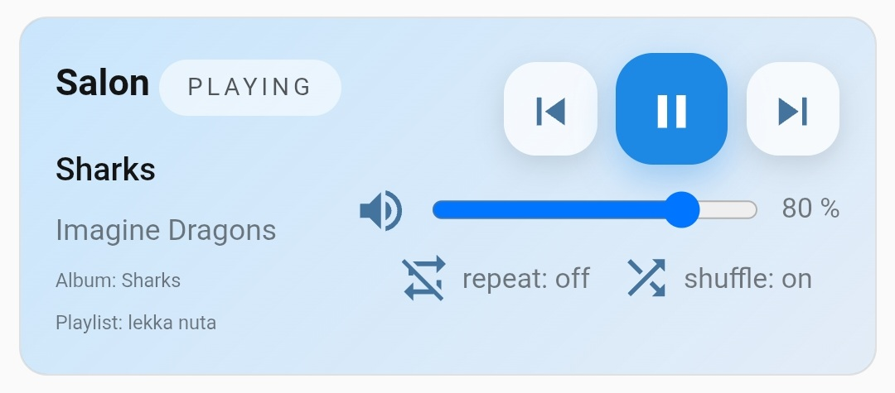
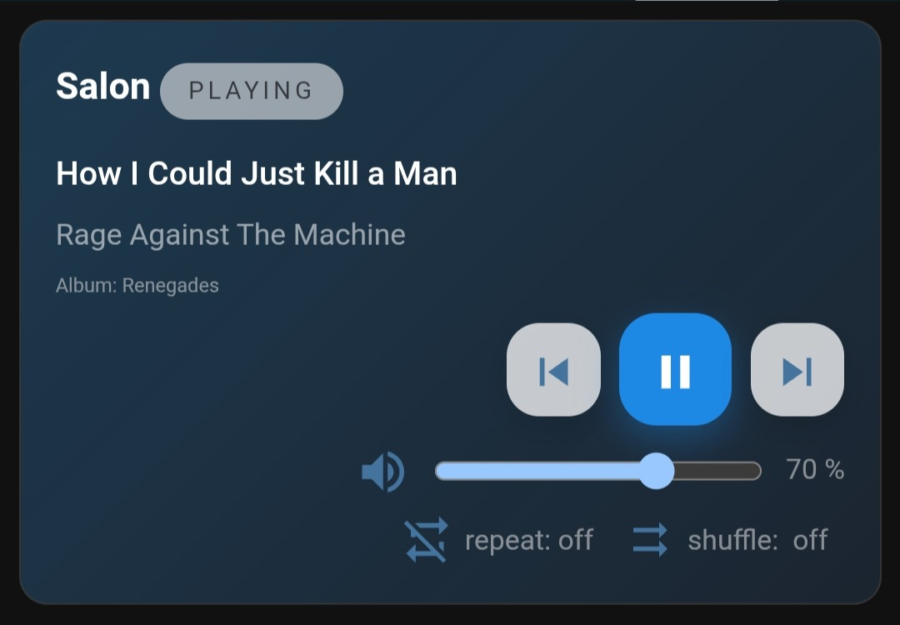
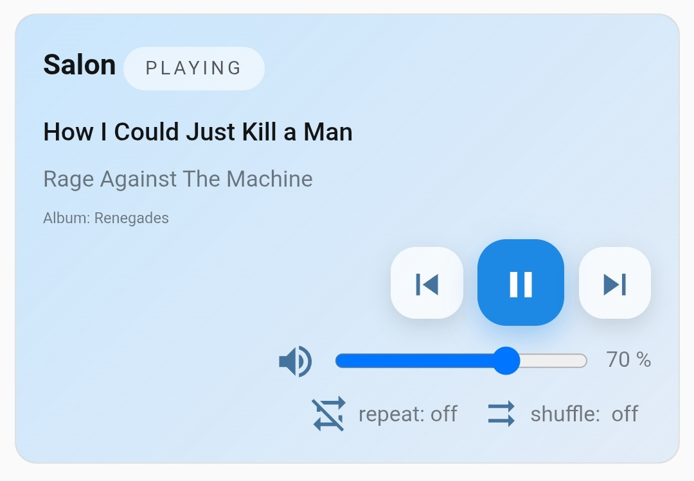

# Media player (template)

Below you'll find an example of using HTML temples in FCC. The simple instructions below will allow you to run this template on your own, allowing you to see how the templates work.

1) Add a new card to the dashboard and overwrite its entire configuration with the [media-player.yaml](media-player.yaml) file (remember to replace the entities with your own).
2) To make the volume slider work, you need to do two things:  
  a) add the automations [from player to slider](automation-playerToSlider.yaml) and [from slider to player](automation-sliderToPlayer.yaml) (remember to replace the entities with your own)  
  b) add two [input_number](input-number.yaml)

After restarting, everything should work.

