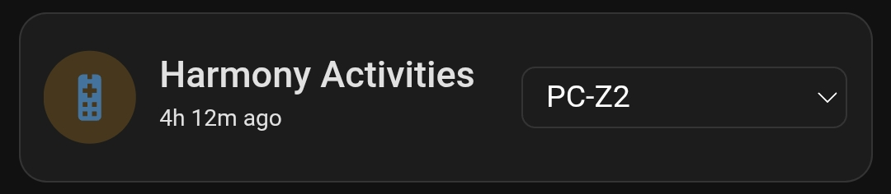
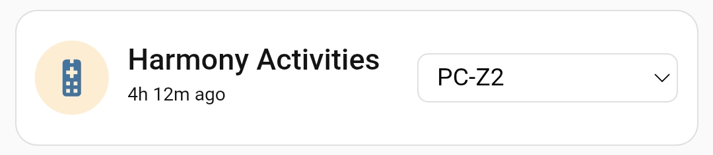

# Select

An example of a card with a dropdown list. This example is based on the "Mushroom Select Card." A simple cell template is used to display two pieces of information in one cell. The second row is hidden using CSS instead of dynamic rules, allowing its elements to still be displayed through cell templates.

Add a new card to the dashboard and overwrite its entire configuration with the [select.yaml](select.yaml) file (remember to replace the entities with your own).

