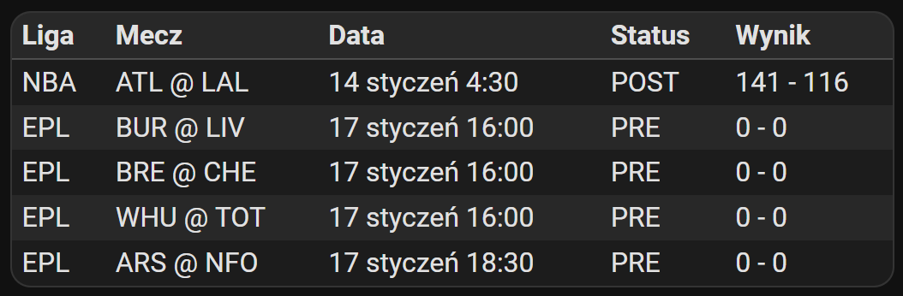
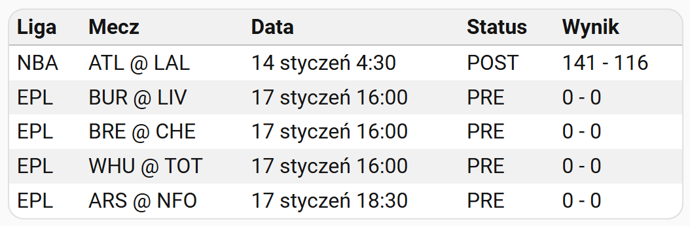

# Sports table

Tracking sports data using [auto-entities](https://github.com/thomasloven/lovelace-auto-entities) and [TeamTracker](https://github.com/vasqued2/ha-teamtracker). TeamTracker has its own [card](https://github.com/vasqued2/ha-teamtracker-card), but that doesn't mean the data can't be displayed in the FCC. TeamTracker serves as the data source, but you can use any other data source. The time is formatted in FCC and displayed for your time zone.

Add a new card to the dashboard and overwrite its entire configuration with the [sports-table.yaml](sports-table.yaml) file (remember to replace the entities with your own).

