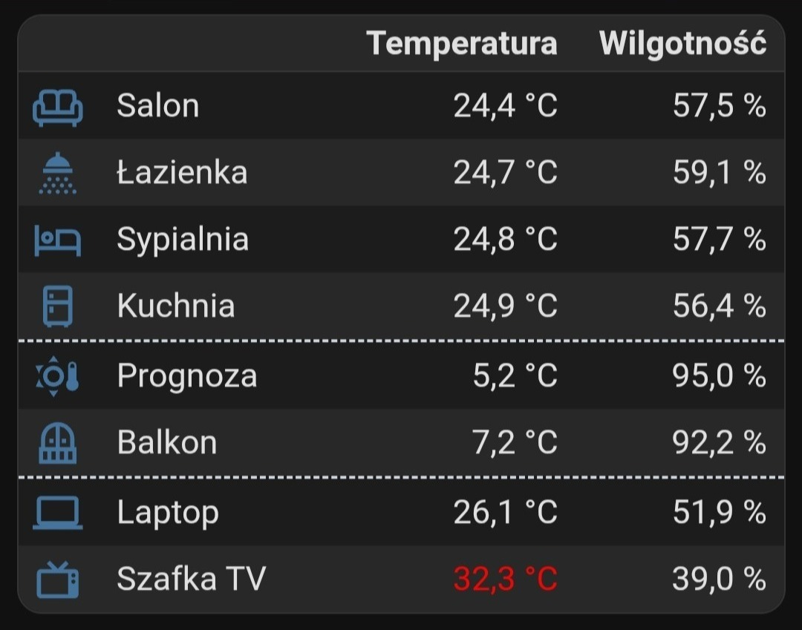
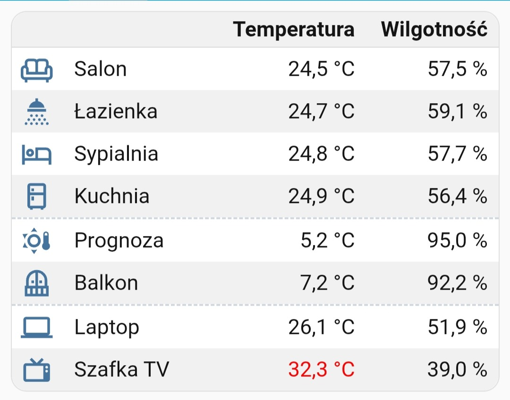

# Temperature/Humidity table

 Simple table divided into three groups, with sorting by the temperature column performed independently in each group. Here you'll find the simplest example of a dynamic rule that changes color to red when the temperature exceeds a specified value.

Add a new card to the dashboard and overwrite its entire configuration with the [temperature-humidity.yaml](temperature-humidity.yaml) file (remember to replace the entities with your own).

